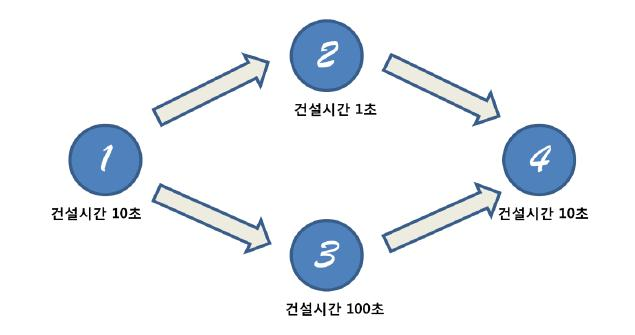

## G3) 1005. ACM Craft

### 문제

서기 2012년! 드디어 2년간 수많은 국민들을 기다리게 한 게임 ACM Craft (Association of Construction Manager Craft)가 발매되었다.

이 게임은 지금까지 나온 게임들과는 다르게 ACM크래프트는 다이나믹한 게임 진행을 위해 건물을 짓는 순서가 정해져 있지 않다. 즉, 첫 번째 게임과 두 번째 게임이 건물을 짓는 순서가 다를 수도 있다. 매 게임시작 시 건물을 짓는 순서가 주어진다. 또한 모든 건물은 각각 건설을 시작하여 완성이 될 때까지 Delay가 존재한다.



위의 예시를 보자.

이번 게임에서는 다음과 같이 건설 순서 규칙이 주어졌다. 1번 건물의 건설이 완료된다면 2번과 3번의 건설을 시작할수 있다. (동시에 진행이 가능하다) 그리고 4번 건물을 짓기 위해서는 2번과 3번 건물이 모두 건설 완료되어야지만 4번건물의 건설을 시작할수 있다.

따라서 4번건물의 건설을 완료하기 위해서는 우선 처음 1번 건물을 건설하는데 10초가 소요된다. 그리고 2번 건물과 3번 건물을 동시에 건설하기 시작하면 2번은 1초뒤에 건설이 완료되지만 아직 3번 건물이 완료되지 않았으므로 4번 건물을 건설할 수 없다. 3번 건물이 완성되고 나면 그때 4번 건물을 지을수 있으므로 4번 건물이 완성되기까지는 총 120초가 소요된다.

프로게이머 최백준은 애인과의 데이트 비용을 마련하기 위해 서강대학교배 ACM크래프트 대회에 참가했다! 최백준은 화려한 컨트롤 실력을 가지고 있기 때문에 모든 경기에서 특정 건물만 짓는다면 무조건 게임에서 이길 수 있다. 그러나 매 게임마다 특정건물을 짓기 위한 순서가 달라지므로 최백준은 좌절하고 있었다. 백준이를 위해 특정건물을 가장 빨리 지을 때까지 걸리는 최소시간을 알아내는 프로그램을 작성해주자.

### 입력

첫째 줄에는 테스트케이스의 개수 T가 주어진다. 각 테스트 케이스는 다음과 같이 주어진다. 첫째 줄에 건물의 개수 N과 건물간의 건설순서 규칙의 총 개수 K이 주어진다. (건물의 번호는 1번부터 N번까지 존재한다)

둘째 줄에는 각 건물당 건설에 걸리는 시간 D1, D2, ..., DN이 공백을 사이로 주어진다. 셋째 줄부터 K+2줄까지 건설순서 X Y가 주어진다. (이는 건물 X를 지은 다음에 건물 Y를 짓는 것이 가능하다는 의미이다)

마지막 줄에는 백준이가 승리하기 위해 건설해야 할 건물의 번호 W가 주어진다.

### 출력

건물 W를 건설완료 하는데 드는 최소 시간을 출력한다. 편의상 건물을 짓는 명령을 내리는 데는 시간이 소요되지 않는다고 가정한다.

건설순서는 모든 건물이 건설 가능하도록 주어진다.

### 제한

- 2 ≤ N ≤ 1000

- 1 ≤ K ≤ 100,000

- 1 ≤ X, Y, W ≤ N

- 0 ≤ Di ≤ 100,000, Di는 정수

### 풀이

dp와 pre 배열을 생성하여 dp에는 현재 건물을 짓는데 걸리는 총 시간, pre에는 이 건물을 짓기 위해 필요한 건물의 수를 저장하였다.

맨 처음 반복문을 돌면서 선행 건물이 없는 건물의 번호를 큐에 집어 넣고 dp에 해당 건물을 짓는데 걸리는 시간을 저장하였다. (선행 건물이 없으므로 건물을 짓는 시간만 소요)

이후 bfs로 순회를 하며 다음 건물의 pre를 하나 줄이고 만일 해당 건물의 pre가 0이라면 큐에 해당 건물 번호를 추가하였다.

bfs로 순회하면서 dp 값도 바꾸어야 하는데 해당 건물의 이전에 몇 개의 건물이 있든지 이전 건물을 짓는 시간 중 가장 긴 시간 만큼 기다려야 다음 건물을 지을 수 있기 때문에 다음 점화식을 적용하였다.

- dp[next] = max(dp[next], dp[cur] + delay[next])

### 코드

```java

import java.util.*;
import java.io.*;

public class Main {
  static int T, N, K, W;
  static int[] delays, dp, pre;
  static ArrayList[] graph;
  static boolean[] visited;
  static Queue<Integer> queue;
  public static void main (String[] args) throws Exception {
    BufferedReader br = new BufferedReader(new InputStreamReader(System.in));
    BufferedWriter bw = new BufferedWriter(new OutputStreamWriter(System.out));
    StringBuilder sb = new StringBuilder();
    StringTokenizer st;

    T = Integer.parseInt(br.readLine());

    for (int i = 0; i < T; i++) {
      queue = new LinkedList<>();

      st = new StringTokenizer(br.readLine());

      N = Integer.parseInt(st.nextToken());
      K = Integer.parseInt(st.nextToken());

      dp = new int[N + 1];
      pre = new int[N + 1];
      delays = new int[N + 1];
      graph = new ArrayList[N + 1];
      for (int j = 1; j <= N; j++) {
        graph[j] = new ArrayList<Integer>();
      }

      st = new StringTokenizer(br.readLine());
      for (int j = 1; j <= N; j++) {
        delays[j] = Integer.parseInt(st.nextToken());
      }

      for (int j = 0; j < K; j++) {
        st = new StringTokenizer(br.readLine());

        int start = Integer.parseInt(st.nextToken());
        int end = Integer.parseInt(st.nextToken());
        pre[end]++;

        graph[start].add(end);
      }

      W = Integer.parseInt(br.readLine());

      for (int j = 1; j <= N; j++) {
        if (pre[j] == 0) {
          dp[j] = delays[j];
          queue.add(j);
        }
      }

      while (!queue.isEmpty()) {
        int cur = queue.remove();
        for (int j = 0; j < graph[cur].size(); j++) {
          int next = (int)graph[cur].get(j);
          dp[next] = Math.max(dp[next], delays[next] + dp[cur]);
          if (--pre[next] == 0) {
            queue.add(next);
          }
        }
      }
      sb.append(dp[W] + "\n");
    }
    bw.write(sb.toString());
    bw.flush();
    br.close(); bw.close();
  }
}
```
