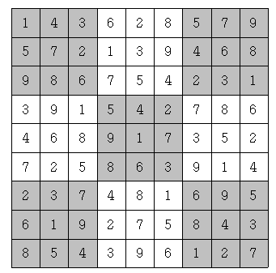

## G4) 2239. 스도쿠

### 문제

스도쿠는 매우 간단한 숫자 퍼즐이다. 9×9 크기의 보드가 있을 때, 각 행과 각 열, 그리고 9개의 3×3 크기의 보드에 1부터 9까지의 숫자가 중복 없이 나타나도록 보드를 채우면 된다. 예를 들어 다음을 보자.



위 그림은 참 잘도 스도쿠 퍼즐을 푼 경우이다. 각 행에 1부터 9까지의 숫자가 중복 없이 나오고, 각 열에 1부터 9까지의 숫자가 중복 없이 나오고, 각 3×3짜리 사각형(9개이며, 위에서 색깔로 표시되었다)에 1부터 9까지의 숫자가 중복 없이 나오기 때문이다.

하다 만 스도쿠 퍼즐이 주어졌을 때, 마저 끝내는 프로그램을 작성하시오.

### 입력

9개의 줄에 9개의 숫자로 보드가 입력된다. 아직 숫자가 채워지지 않은 칸에는 0이 주어진다.

### 출력

9개의 줄에 9개의 숫자로 답을 출력한다. 답이 여러 개 있다면 그 중 사전식으로 앞서는 것을 출력한다. 즉, 81자리의 수가 제일 작은 경우를 출력한다.

### 풀이

백트래킹을 이용하는 문제였다. 편의를 위해 각 행과 열을 따로 표기하는 것이 아니라 pos 매개변수를 사용하여 함수 내에서 pos / 9, pos % 9로 행과 열을 분리하여 사용하였다.

해당 위치의 값이 0이 아니라면 바로 다음 위치로 넘어가고 만일 0이라면 행과 열, 해당 위치가 포함된 사각형을 확인하여 어떤 숫자가 올 수 있는지 체크하고 해당 하는 숫자를 처음부터 대입해본 뒤에 다음 위치로 넘어가도록 코드를 작성하였다.

답이 여러개일 경우 사전 순으로 가장 먼저 오는 답을 출력해야 하기 때문에 (0, 0)부터 (8, 8)까지 행 우선으로 스도쿠를 채워나가야하며, pos가 81일 경우 백트래킹을 종료하기위해 boolean 타입의 전역변수 flag를 선언하였다.

### 코드

```java
import java.util.*;
import java.io.*;

public class Main {
	static int[][] sdoku;
	static boolean flag;
	public static void main(String[] args) throws Exception {
		BufferedReader br = new BufferedReader(new InputStreamReader(System.in));
		BufferedWriter bw = new BufferedWriter(new OutputStreamWriter(System.out));
		StringBuilder sb = new StringBuilder();

		sdoku = new int[9][9];

		for (int i = 0; i < 9; i++) {
			String row = br.readLine();

			for (int j = 0; j < 9; j++) {
				sdoku[i][j] = row.charAt(j) - '0';
			}
		}

		backtracking(0);

		for (int i = 0; i < 9; i++) {
			for (int j = 0; j < 9; j++) {
				sb.append(sdoku[i][j]);
			}
			sb.append("\n");
		}

		bw.write(sb.toString());
		bw.flush();
		br.close();
		bw.close();
	}
	static void backtracking(int pos) {
		if (pos == 81) {
			flag = true;
			return;
		}
		int r = pos / 9;
		int c = pos % 9;
		if (sdoku[r][c] == 0) {
			boolean[] nums = new boolean[10];
			checkRow(r, c, nums);
			checkArea(r, c, nums);
			checkColumn(r, c, nums);
			for (int i = 1; i <= 9; i++) {
				if (!nums[i]) {
					sdoku[r][c] = i;
					backtracking(pos + 1);
					if(flag) {
						return;
					}
					sdoku[r][c] = 0;
				}
			}
		} else {
				backtracking(pos + 1);
		}
	}
	static void checkRow(int r, int c, boolean[] nums) {
		for (int i = 0; i < 9; i++) {
			if (sdoku[r][i] != 0) {
				nums[sdoku[r][i]] = true;
			}
		}
	}
	static void checkArea(int r, int c, boolean[] nums) {
		int startR = r / 3 * 3;
		int startC = c / 3 * 3;
		for (int i = startR; i < startR + 3; i++) {
			for (int j = startC; j < startC + 3; j++) {
				if (sdoku[i][j] != 0) {
					nums[sdoku[i][j]] = true;
				}
			}
		}
	}
	static void checkColumn(int r, int c, boolean[] nums) {
		for (int i = 0; i < 9; i++) {
			if (sdoku[i][c] != 0) {
				nums[sdoku[i][c]] = true;
			}
		}
	}
}

```
