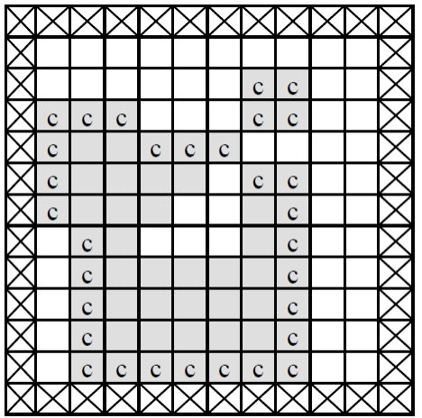
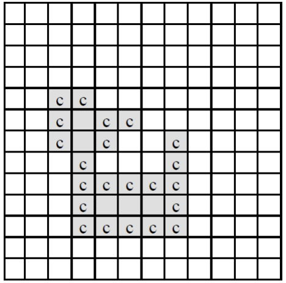
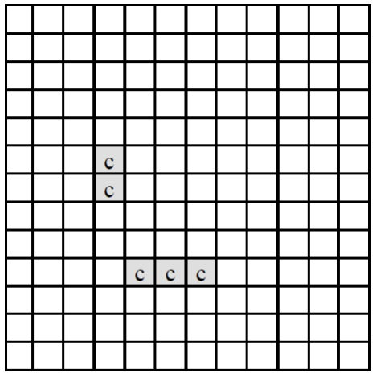

## G4) 2636. 치즈

### 문제

아래 <그림 1>과 같이 정사각형 칸들로 이루어진 사각형 모양의 판이 있고, 그 위에 얇은 치즈(회색으로 표시된 부분)가 놓여 있다. 판의 가장자리(<그림 1>에서 네모 칸에 X친 부분)에는 치즈가 놓여 있지 않으며 치즈에는 하나 이상의 구멍이 있을 수 있다.

이 치즈를 공기 중에 놓으면 녹게 되는데 공기와 접촉된 칸은 한 시간이 지나면 녹아 없어진다. 치즈의 구멍 속에는 공기가 없지만 구멍을 둘러싼 치즈가 녹아서 구멍이 열리면 구멍 속으로 공기가 들어가게 된다. <그림 1>의 경우, 치즈의 구멍을 둘러싼 치즈는 녹지 않고 ‘c’로 표시된 부분만 한 시간 후에 녹아 없어져서 <그림 2>와 같이 된다.



<center>(그림 1)</center>

다시 한 시간 후에는 <그림 2>에서 ‘c’로 표시된 부분이 녹아 없어져서 <그림 3>과 같이 된다.



<center>(그림 2)</center>



<center>(그림 3)</center>

<그림 3>은 원래 치즈의 두 시간 후 모양을 나타내고 있으며, 남은 조각들은 한 시간이 더 지나면 모두 녹아 없어진다. 그러므로 처음 치즈가 모두 녹아 없어지는 데는 세 시간이 걸린다. <그림 3>과 같이 치즈가 녹는 과정에서 여러 조각으로 나누어 질 수도 있다.

입력으로 사각형 모양의 판의 크기와 한 조각의 치즈가 판 위에 주어졌을 때, 공기 중에서 치즈가 모두 녹아 없어지는 데 걸리는 시간과 모두 녹기 한 시간 전에 남아있는 치즈조각이 놓여 있는 칸의 개수를 구하는 프로그램을 작성하시오.

### 입력

첫째 줄에는 사각형 모양 판의 세로와 가로의 길이가 양의 정수로 주어진다. 세로와 가로의 길이는 최대 100이다. 판의 각 가로줄의 모양이 윗 줄부터 차례로 둘째 줄부터 마지막 줄까지 주어진다. 치즈가 없는 칸은 0, 치즈가 있는 칸은 1로 주어지며 각 숫자 사이에는 빈칸이 하나씩 있다.

### 출력

첫째 줄에는 치즈가 모두 녹아서 없어지는 데 걸리는 시간을 출력하고, 둘째 줄에는 모두 녹기 한 시간 전에 남아있는 치즈조각이 놓여 있는 칸의 개수를 출력한다.

### 풀이

BFS를 활용한 구현 문제였다.

판의 각 칸들은 0 - 구멍, 1 - 치즈, 2 - 공기의 3가지 상태를 가진다.

맨 처음 칸의 가장자리에서 그래프 탐색을 이용하여 치즈 외부 구멍들을 전부 공기 상태로 만들어 준 다음, 판에서 치즈가 사라질 때 까지 공기와 인접한 치즈들을 전부 구멍으로 만들고, 공기와 인접한 구멍들을 전부 공기로 만든다.

### 코드

```java
import java.util.*;
import java.io.*;

public class Main {
	static int N, M, prev, t, num;
	static int[][] cheese;
	static Queue<int[]> queue;
	static int[] dy = {-1, 1, 0, 0};
	static int[] dx = {0, 0, -1, 1};
	public static void main(String[] args) throws Exception {
		BufferedReader br = new BufferedReader(new InputStreamReader(System.in));
		BufferedWriter bw = new BufferedWriter(new OutputStreamWriter(System.out));
		StringTokenizer st = new StringTokenizer(br.readLine());

		N = Integer.parseInt(st.nextToken());
		M = Integer.parseInt(st.nextToken());

		cheese = new int[N][M];
		queue = new LinkedList<>();

		for (int i = 0; i < N; i++) {
			st = new StringTokenizer(br.readLine());

			for (int j = 0; j < M; j++) {
				cheese[i][j] = Integer.parseInt(st.nextToken());
				if (cheese[i][j] == 1) {
					num++;
				}
			}
		}

		cheese[0][0] = 2;
		queue.add(new int[] {0, 0});
		while (!queue.isEmpty()) {
			int[] cur = queue.poll();

			for (int i = 0; i < 4; i++) {
				int ny = cur[0] + dy[i];
				int nx = cur[1] + dx[i];

				if (ny >= 0 && nx >= 0 && ny < N && nx < M && cheese[ny][nx] == 0) {
					cheese[ny][nx] = 2;
					queue.add(new int[] {ny, nx});
				}
			}
		}
		/*
		 * 2로 채움
		 * 2근처 1을 0으로 바꾸기
		 * 2근처 0을 2로 바꾸기
		 * 1이 사라질 때 까지 2를 반복
		 * 1이 사라지면 직전 값 출력
		 */
		while (true) {
			t++;
			prev = num;
			for (int i = 1; i < N - 1; i++) {
				for (int j = 1; j < M - 1; j++) {
					if (cheese[i][j] == 1 && (cheese[i - 1][j] == 2 || cheese[i + 1][j] == 2 || cheese[i][j - 1] == 2 || cheese[i][j + 1] == 2)) {
						cheese[i][j] = 0;
						num--;
					}
				}
			}
			if (num == 0) {
				break;
			}
			for (int i = 1; i < N - 1; i++) {
				for (int j = 1; j < M - 1; j++) {
					if (cheese[i][j] == 0 && (cheese[i - 1][j] == 2 || cheese[i + 1][j] == 2 || cheese[i][j - 1] == 2 || cheese[i][j + 1]== 2)) {
						cheese[i][j] = 2;
						queue.add(new int[] {i, j});
						while (!queue.isEmpty()) {
							int[] cur = queue.poll();

							for (int k = 0; k < 4; k++) {
								int ny = cur[0] + dy[k];
								int nx = cur[1] + dx[k];

								if (ny > 0 && nx > 0 && ny < N - 1 && nx < M - 1 && cheese[ny][nx] == 0) {
									cheese[ny][nx] = 2;
									queue.add(new int[] {ny, nx});
								}
							}
						}
					}
				}
			}
		}
		bw.write(t + "\n" + prev + "\n");
		bw.flush();
		br.close();
		bw.close();
	}

}

```
