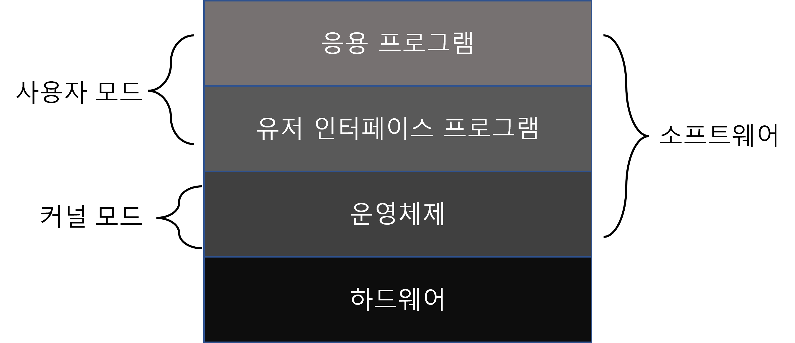

## 운영체제란?

운영체제(Operating System)은 컴퓨터 자원들을 효율적으로 관리하고, 사용자와 프로그램에게 컴퓨터에 대한 보다 쉽고, 단순한 모델을 제시하는 시스템 소프트웨어이다.

### 컴퓨터 자원을 추상화

하드웨어의 복잡한 구조를 사용자가 이해하기 쉽도록 추상화를 만들어 내고, 이러한 추상화 객체들을 관리하는 역할을 한다.

ex) 파일

### 자원 관리

컴퓨터 자원을 얻으려고 서로 경쟁하는 프로그램, 사용자들의 요청을 중재한다.

자원 관리는 두 가지 관점에서의 멀티플렉싱(multiplexing) 하는 것을 포함하는데 하나는 시간적인 측면에서의 멀티플렉싱이고, 다른 하나는 공간적인 측면에서의 멀티플렉싱이다.

시간

- 여러 프로그램 또는 사용자가 자원을 돌아가면서 사용한다.

- ex) 프린터

공간

- 순서에 따라 자원을 갖는 것이 아닌 자원의 일부를 갖는다.

- ex) 메인 메모리에 상주하는 프로세스들, 디스크에 저장된 파일들
