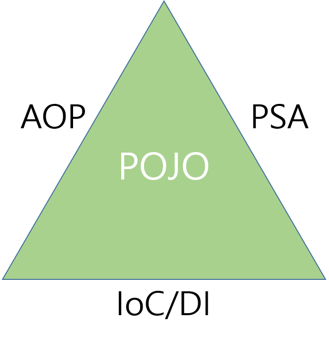

### Spring이란?

EJB를 대체하기 위해 개발된 오픈 소스 프레임워크이다.

스프링 이전에는 일반적으로 자바 엔터프라이즈 애플리케이션을 개발할 때 EJB(Enterprise Java Beans)를 사용하였다.

하지만 EJB에는 다음과 같은 단점이 있었는데,

1. 복잡한 스펙으로 인해 개발의 효율성이 떨어지고,

2. EJB 스펙에 정의된 인터페이스에 따라 코드를 작성해야했기 때문에 기존에 작성된 POJO(Plain Old Java Object)를 변경해야 했으며,

3. 배우기 어렵고, 설정해야 할 부분이 많았다.

4. 뿐만 아니라 EJB는 RMI(Remote Method Invocation)를 기반으로 하는 서버이므로 무거운 Container였다.

이러한 단점들로 인해 점차 POJO와 경량 프레임워크를 사용하기 시작하면서 EJB보다 더 쉽고 편리한 오픈소스 프레임워크인 Spring이 각광받았다.

### Spring 프레임워크의 구조

- Spring 삼각형

  Enterprise 애플리케이션 개발 시 복잡함을 해결하는 Spring의 핵심이다.

- POJO (Plain Old Java Object)

  - 특정 환경이나 기술에 종속적이지 않은 객체지향 원리에 충실한 자바 객체이다.

  - 테스트하기 용이하며, 객체지향 설계를 자유롭게 적용 가능하다.

- PSA (Portable Service Abstraction)

  - 환경과 세부 기술의 변경과 관계없이 일관된 방식으로 기술에 접근할 수 있게 해주는 설계 원칙이다.

  - 트랜잭션 추상화, OXM 추상화, 데이터 액세스의 Exception 변환기능 등 기술적인 복잡함은 추상화를 통해 Low Level의 기술 구현 부분과 기술을 사용하는 인터페이스로 분리하였다.

- IoC (Inversion of Control, 제어의 역전)/DI (Dependency Injection)

  - 기존 Java 개발자는 new, 인터페이스 호출, 클래스 호출 방식 등으로 객체를 직접 생성하고 소멸시켰다.

  - IoC는 객체의 생성부터 소멸까지의 Life Cycle 관리를 개발자가 하는 것이 아닌 Spring(Container)가 대신 해주는 것을 의미한다.

  - 제어권이 개발자가 아닌 Spring에게 있기 때문에 제어의 역전이라 부른다.

  - DI는 유연하게 확장 가능한 객체를 미리 만들어 두고 객체 간의 의존 관계는 외부 파일을 통해 설정해주는 것을 의미한다.

  - 코드 재사용을 높여 소스코드를 다양한 곳에 사용할 수 있고, 모듈간의 결합도도 낮춘다.

- AOP (Aspect Oriented Programming)

  - 관심사의 분리를 통해 소프트웨어의 모듈성을 향상 시킨다.

  - 공통 모듈을 여러 코드에 쉽게 적용 가능하다.

  - 객체지향 프로그래밍을 더욱 객체지향스럽게 만드는 기능이다.
