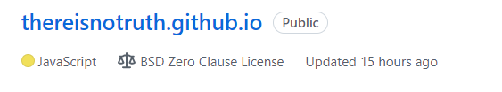
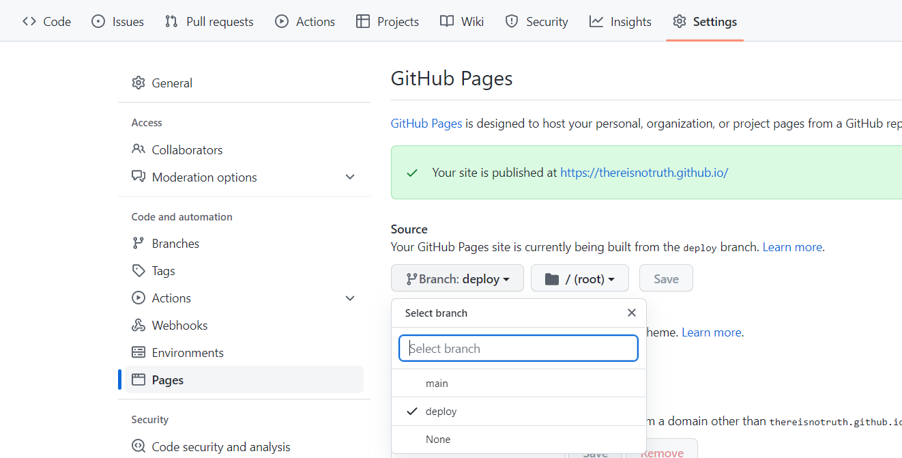
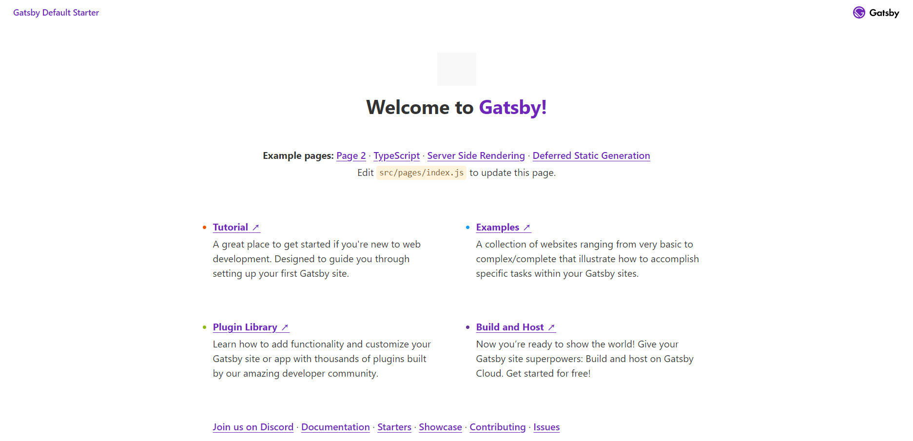

이제 로컬에 블로그를 작성할 환경을 만들어 주어야 한다.

### 1. Repository

우선 블로그에 관련된 파일들을 저장할 Github Repository를 생성해야 한다.

Repository의 이름은 (Github username).github.io 로 만든다.



생성한 Repository를 clone하면 1단계는 끝이다.

```bash
git clone (Repository)
```

<br />

### 2. Gatsby

Repository를 만든 후, clone까지 마쳤다면 npm으로 gatsby를 설치해주면 된다.

npm을 이용하기 위해서는 nodejs가 사전에 설치되어 있어야 한다.

```bash
npm install -g gatsby-cli
```


### 3. 프로젝트 생성

터미널에서 다음의 명령어로 Gatsby 프로젝트를 생성할 수 있다.

```bash
gatsby new [repository name] [theme address]
```

테마는 Gatsby Starter Library에서 둘러볼 수 있는데 테마를 지정해주지 않는다면 gatsby-starter-default 테마가 적용된다.

나는 블로그 내 컴포넌트들을 하나하나 만들 것이기 때문에 테마를 따로 지정하지 않았다.


### 4. gh-pages

Github에서 사이트를 배포하기 위해 gh-pages를 설치한다.

```bash
npm install gh-pages
```

gh-pages를 설치하였으면 package.json 파일을 수정해주어야 하는데 다음의 명령어를 추가해준다.

```json
"scripts": {
  ...
  "deploy": "gatsby build && gh-pages -d public -b deploy",
  ...
}
```

deploy는 배포용 브랜치이다.  위 명령어를 추가하고 `npm run deploy`를 실행하면 자동으로 생성된다. 블로그 포스트를 작성하고 위 명령어를 실행해주어야 블로그에 반영 된다.

이후 Repository - Settings - Pages에서 배포 브랜치를 deploy로 바꿔준다.




이제 생성된 페이지의 주소로 접속해보면 잘 생성된 것을 확인할 수 있다.

